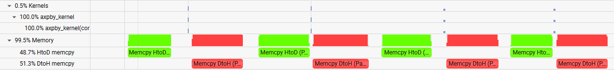
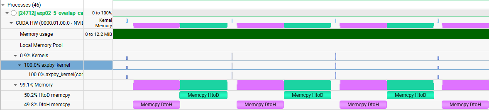
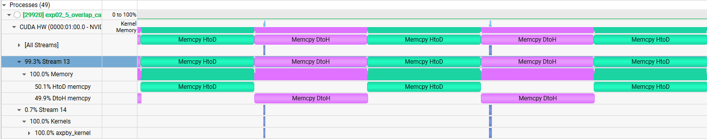
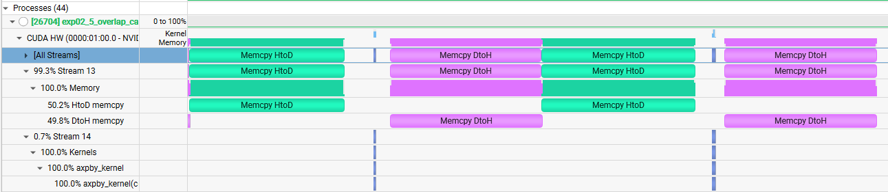
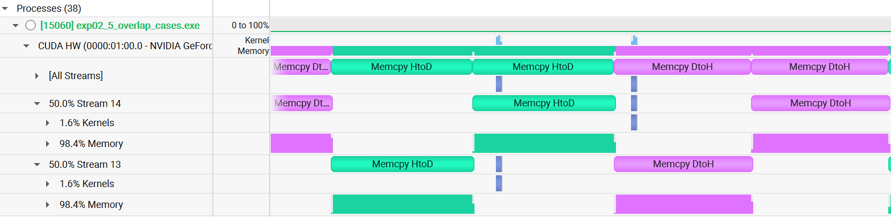
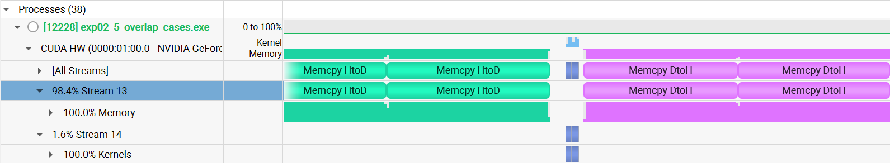

## Case A: pageable memory single stream single buffer

- page locked가 아닌 pageable이기 때문에, host 메모리에서 latency가 증가하는 모습이 보임

- 위 사진에서 볼 수 있듯이 host 작업이 있는 구간은 간격이 있는 것을 확인할 수 있음
- single stream이기 때문에 작업 간 겹침은 일어나지 않음 (compute와 copy가 직렬화 되어 있음)

## Case B: pinned(page-locked) memory single stream single buffer

- pinned 메모리이기 때문에 host 작업 구간 사이 latency가 거의 없음

- 위 사진에서 볼 수 있듯 겹침은 없지만, 여전히 single stream이기 때문에 작업 간 겹침은 없음

## Case C: pinned(page-locked) memory double stream single buffer

- 역시나 pinned 메모리이기 때문에 host 작업 구간 사이 latency는 없음

- 위 사진에서 볼 수 있듯이, DtoH와 kernel 연산 사이에는 synchronize 구간이 없기 때문에 서로 다른 stream에서 작업 간 겹침 발생 확인

## Case D: pinned(page-locked) memory double stream double buffer

- HtoD와 kernel 사이의 동기화, kernel과 DtoH 사이의 동기화가 있어 동기화에 의한 latency + 작업 직렬화(stream이 나뉘어 있음에도)가 된 것을 확인

## Result bench-table

| Case | Batch | Elements | Iters | Warmup | Buffers | Pinned | Two Streams | GPU (ms) | CPU (ms) | Avg Iter (ms) | Throughput (Gelem/s) | Checksum |
|------|-------|----------|-------|--------|---------|--------|-------------|----------|----------|---------------|----------------------|----------|
| A_pageable_single_single | 16 | 100000 | 10 | 5 | 1 | 0 | 0 | 17.817087 | 17.887900 | 1.788790 | 0.894459 | 2640005.575000 |
| B_pinned_single_single | 16 | 100000 | 10 | 5 | 1 | 1 | 0 | 11.016512 | 11.083300 | 1.108330 | 1.443613 | 2640005.575000 |
| C_pinned_two_single | 16 | 100000 | 10 | 5 | 1 | 1 | 1 | 9.693600 | 9.870000 | 0.987000 | 1.621074 | 2640005.575000 |
| D_pinned_two_double | 16 | 100000 | 10 | 5 | 2 | 1 | 1 | 10.597856 | 11.162100 | 1.116210 | 1.433422 | 5280011.161000 |

- Case A pageable single single 경우, Avg Iter latency가 가장 큰 것을 확인할 수 있음 (host latency, single stream serialization)
- Case B pinned single single 경우, A보다 좀 더 host latency가 줄어들어 Avg Iter가 확연이 줆을 확인할 수 있음
- Case C pinned two single 경우, copy/compute stream을 나눈 효과와 pinned로 구성한 효과로 겹침이 있어 계산 효율 향상으로 인해 Avg Iter가 가장 낮고, Throughput이 가장 높음
- Case D pinned two double 경우, stream/pinned의 이득은 있으나, 동기화 구간으로 인한 직렬화로 Case C보다 높은 Avg Iter latency를 보임

## Modified Case D: double stream double buffer overlap

- 기존 코드는 stream 두 개를 이용하여 실험하였으나 copy/compute stream간 synchronize로 인해 overlap이 의도적으로 배제되었음
- 그래서 실험 구조를 바꾸어 stream간 연산 중첩을 구현
- 실험 결과 연산 중첩이 일어나지 않음

 > `RTX 4070 laptop` 기준으로 copy engine이 1개이기 때문에, copy는 중첩이 되지 않음
 > async로 stream을 나누어도 중첩이 되지 않음

 ## Case E: pinned copy overlap

- 해당 실험은 DtoH - HtoD 간의 방향성이 달라 copy engine 중첩이 일어나지 않은 것을 가정
- `RTX 4070 laptop` 환경에서 DtoH - DtoH, HtoD - HtoD로 방향을 중첩하면 stream간 copy 병렬화가 되는 가에 대한 실험을 추가
 

- 실험 결과, copy 간 방향성을 통일하여도 중첩이 되지 않는 것을 확인
- 이는 하나의 copy engine은 하나의 작업만을 수행할 수 있음을 확인

- 추가 실험에서 copy stream을 하나로 통일하여도 결과는 동일
- **결론적으로 copy engine 하나에서 병렬화된 copy 작업을 기대할 수 없음**

